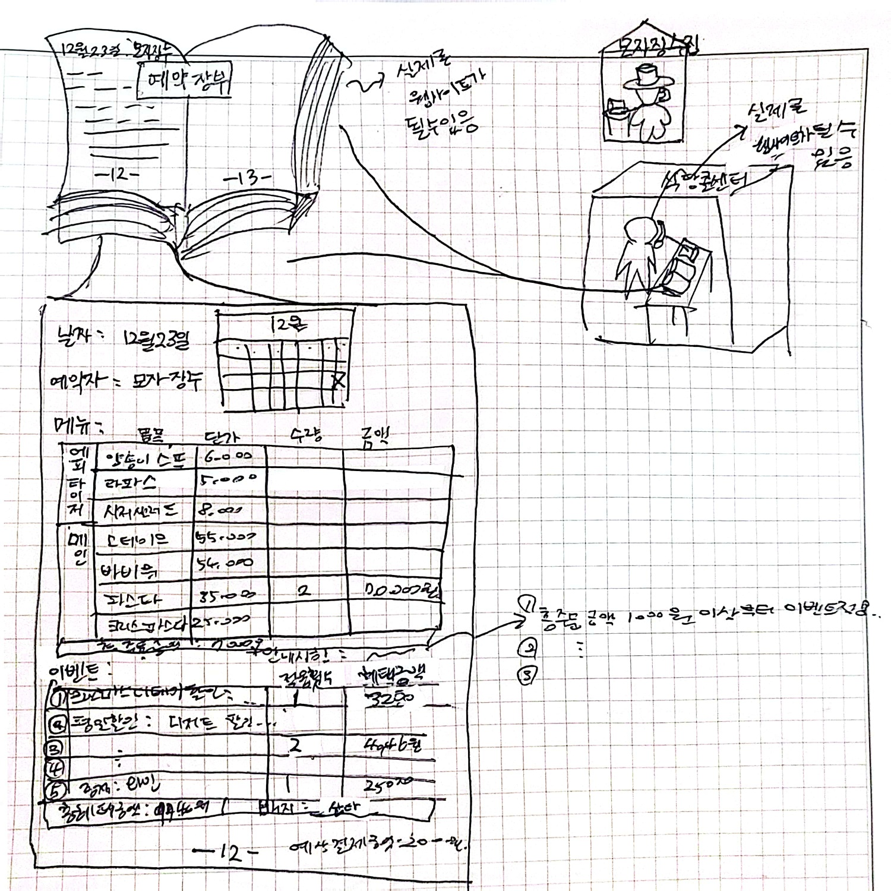

# 기능 구현 목록 - 크리스마스 프로모션

## 📘 `12월 이벤트 플래너` 프로그램 설명

### 개요

- `예상 방문 날짜`와 `예상 주문 메뉴`를 고르면, `적용되는 이벤트 내역`과 `이벤트 적용 전/후 예상 금액`을 알려주어 `식당의 이벤트를 홍보`하는 프로그램이다.
- `적용되는 이벤트`로는 `할인`, `증정`, `배지`가 있는데, 자세히 알고 싶다면 아래 부록의 `A. 기능 요구 사항 - 1) 이벤트 설명`에서 확인할 수 있다.

### 특이사항

- 프로그램의 현재 날짜는 11월 20일로 지정되어 있다.
- 프로그램의 정식 명칭은 `12월 이벤트 플래너`이고, 줄여서 `이벤트 플래너(EventPlanner)`라고 일컫기도 한다.

### 용어 정의

- 계획자 (Event Planner)
    - 계획을 세우는 사람이다. 코드 상으론 컨트롤러가 그 역할을 대체한다.
- 계획 (Plan)
    - 계획(내지 계획표)에 사용자의 방문 날짜, 메뉴를 기록해두고,
    - 해당 계획에 대해 이벤트를 적용한 결과값을 만든다.
    - 계획(내지 계획표)의 구성을 보고 싶다면 아래 부록의 `B-1.초안` 참고하길 바란다.

## 🗂️ Model

### Order (주문서)

- [x]  `메뉴 목록`을 담아 `빈 주문서`를 생성한다
- [x]  주문서에 `주문할 메뉴를 표시`한다
    - [x]  `각 메뉴 개수가 1개 이상이 아닌 경우`, 예외를 발생시킨다
    - [x]  `메뉴 개수 합이 20개를 초과한 경우`, 예외를 발생시킨다
    - [x]  `메뉴에 중복이 있는 경우`, 예외를 발생시킨다
    - [x]  `메뉴에 음료만 있는 경우`, 예외를 발생시킨다
- [x]  `주문 결과(dto)`를 생성한다
    - [x]  `주문 메뉴`, `할인 전 총주문 금액`을 가진다

### Event (이벤트)

- [x]  `이벤트를 주문에 적용`한다
    - [x]  `이벤트 적용 결과(dto)`로 `증정 메뉴`, `혜택 내역`, `총혜택 금액`, `할인 후 예상 결제 금액`, `배지 이름`를 반환한다

## 👩🏻‍💻 View

### InputView

- [x]  `예상 방문 날짜를 입력` 받는다 (`String` → `LocalDate`)
    - [x]  `날짜 형식에 맞지 않는 경우`, 예외를 발생시킨다
    - [x]  `12월의 날짜가 아닌 경우`, 예외를 발생시킨다
    - [x]  `이미 지난 날짜인 경우`, 예외를 발생시킨다
- [x]  `주문 메뉴와 개수를` 쉼표로 구분해 `입력` 받는다 (`String` → `List<OrderRequest>`)
    - [x]  `주문 형식에 맞지 않는 경우`, 예외를 발생시킨다
    - [x]  `메뉴판에 없는 메뉴인 경우`, 예외를 발생시킨다

### OutputView

- [x]  `이벤트 플래너 시작 문구`를 출력한다
- [x]  `이벤트 혜택 미리보기 문구`를 출력한다
- [x]  `주문 결과 내역`을 출력한다
    - [x]  `주문 메뉴`를 출력한다
    - [x]  `할인 전 총주문 금액`을 출력한다
- [x]  `이벤트 결과 내역`을 출력한다
    - [x]  `증정 메뉴`를 출력한다
    - [x]  `혜택 내역`을 출력한다
    - [x]  `총혜택 금액`을 출력한다
    - [x]  `할인 후 예상 결제 금액`을 출력한다
    - [x]  `12월 이벤트 배지 이름`을 출력한다

## 📡 Controller

### EventPlannerController

- [x]  `이벤트 플래너로 계획을 시작`한다
    - [x]  `방문 날짜를 계획`한다
    - [x]  `주문 메뉴를 계획`한다
    - [x]  `이벤트를 계획에 적용`한다

## 🔑 Exception

### PlanDateException

- [x]  입력값인 `예상 방문 날짜`와 관련된 예외를 한데 모아 처리한다

### OrderException

- [x]  입력값인 `주문 메뉴 및 개수`와 관련된 예외를 한데 모아 처리한다

# 부록

## 🚀 A. 기능 요구 사항 : 식당의 이벤트를 위한 개발

### 1) 이벤트 설명

- 목표
    - 중복된 할인과 증정을 허용해, 고객들이 혜택 많이 받는다는 것 체감할 수 있게 하기
    - 올해 12월에 지난 5년 중 최고의 판매 금액을 달성하기
    - 12월 이벤트 참여 고객의 5%가 내년 1월 새해 이벤트에 재참여하게 하기
- 이벤트 내역
    - `크리스마스 디데이 할인`: 2023년 12월 1일에 1,000원부터 시작해 25일까지 매일 100원씩 증가해 총주문 금액에서 할인 (25일은 3,400원 할인)
    - `평일 할인`(일~목요일) : 디저트 메뉴를 1개당 2,203원 할인
    - `주말 할인`(금,토요일) : 메인 메뉴를 1개당 2,023원 할인
    - `특별 할인`(일요일,25일) : 총주문 금액에서 1,000원 할인
    - `증정` 이벤트 : 할인 전 총주문 금액이 12만원 이상일 때, 25,000원짜리 샴페인 1개 증정
- 이벤트 특이사항
    - 총혜택 금액에 따라 `배지`(5천원 이상 `별`, 1만원 이상 `트리`, 2만원 이상 `산타`) 부여
        - 새해 이벤트에서 선물 증정 시 사용할 예정
        - 총혜택 금액은 할인 금액의 합계와 증정 메뉴의 가격을 합한 것
    - '크리스마스 디데이 할인'을 제외한 다른 이벤트는 2023년 12월 1일(금) ~ 2023년 12월 31일(일) 동안 적용
- 메뉴
    ```
    <애피타이저>
    양송이수프(6,000), 타파스(5,500), 시저샐러드(8,000)
    
    <메인>
    티본스테이크(55,000), 바비큐립(54,000), 해산물파스타(35,000), 크리스마스파스타(25,000)
    
    <디저트>
    초코케이크(15,000), 아이스크림(5,000)
    
    <음료>
    제로콜라(3,000), 레드와인(60,000), 샴페인(25,000)
    ```
- 메뉴 주문 시, 고객에게 안내할 주의 사항
    - 모든 이벤트는 중복 적용 가능합니다.
    - 할인 전 총주문 금액이 10,000원 이상일 시, 이벤트가 적용됩니다.
    - 음료만 주문 시, 주문할 수 없습니다.
    - 메뉴는 한 번에 최대 20개까지만 주문할 수 있습니다.(e.g. 시저샐러드-1, 티본스테이크-1, 크리스마스파스타-1, 제로콜라-3, 아이스크림-1의 총개수는 7개)

### 2) 개발 요청 사항

> 🚀 서비스 이름 : 12월 이벤트 플래너
>    - 고객들이 `식당에 방문할 날짜`와 `주문할 메뉴` 미리 선택하면,
>    - `주문 메뉴`, `할인 전 총주문 금액`, `증정 메뉴`, `헤택 내역`, `총혜택 금액`, `할인 후 예상 결제 금액`, `12월 이벤트 배지` 내용 보여주기
>    - 모든 에러는 `[ERROR]`로 시작하기

- 12월 중 식당 예상 `방문 날짜` 입력 받기
    - 방문 날짜는 1이상 31이하의 숫자 → 예외 발생 시 : `[ERROR] 유효하지 않은 날짜입니다. 다시 입력해 주세요.`
        - 숫자가 아닌 값 입력 시, 예외 발생
        - 1이상 31이하가 아닌 숫자 입력 시, 예외 발생
        - 이미 지난 날짜 입력 시, 예외 발생
- `주문할 메뉴와 개수` 입력 받기
    - 주문할 메뉴와 개수는 `해산물파스타-2,레드와인-1,초코케이크-1` 꼴 → 예외 발생 시 : `[ERROR] 유효하지 않은 주문입니다. 다시 입력해 주세요.`
        - 메뉴판에 없는 메뉴 입력 시, 예외 발생
        - 메뉴 개수를 1 미만으로 입력 시, 예외 발생
        - 메뉴 형식이 예시와 다른 경우, 예외 발생
        - 중복 메뉴(e.g. `시저샐러드-1,시저샐러드-1`)를 입력 시, 예외 발생
- `주문 메뉴` 보여주기
    - 출력 순서 자유
- `증정 메뉴` 보여주기
    - 증정 이벤트 없는 경우, “없음”으로 출력
- `혜택 내역` 보여주기
    - 고객에게 적용된 이벤트 내역 출력
    - 적용된 이벤트 없는 경우, 혜택 내역 “없음”으로 출력
    - 여러 개 이벤트 적용된 경우, 출력 순서 자유
- `총 혜택 금액` 보여주기
    - `할인 금액의 합계` + `증정 메뉴의 가격`으로 게산
- `할인 후 예상 결제 금액` 보여주기
    - `할인 전 총주문 금액` - `할인 금액의 합계`으로 게산
- `이벤트 배지 이름` 보여주기
    - 총헤택 금액에 따라 다르게 출력(별, 트리, 산타)
    - 이벤트 배지 부여되지 않는 경우, “없음”으로 출력
- 실행결과 예시
    ```
    안녕하세요! 우테코 식당 12월 이벤트 플래너입니다.
    12월 중 식당 예상 방문 날짜는 언제인가요? (숫자만 입력해 주세요!)
    3
    주문하실 메뉴를 메뉴와 개수를 알려 주세요. (e.g. 해산물파스타-2,레드와인-1,초코케이크-1)
    티본스테이크-1,바비큐립-1,초코케이크-2,제로콜라-1
    12월 3일에 우테코 식당에서 받을 이벤트 혜택 미리 보기!
     
    <주문 메뉴>
    티본스테이크 1개
    바비큐립 1개
    초코케이크 2개
    제로콜라 1개
     
    <할인 전 총주문 금액>
    142,000원
     
    <증정 메뉴>
    샴페인 1개
     
    <혜택 내역>
    크리스마스 디데이 할인: -1,200원
    평일 할인: -4,046원
    특별 할인: -1,000원
    증정 이벤트: -25,000원
     
    <총혜택 금액>
    -31,246원
     
    <할인 후 예상 결제 금액>
    135,754원
     
    <12월 이벤트 배지>
    산타
    ```

## 🚀 B. 스토리텔링식으로 설계해 협력/책임/역할 정하기 (+ 데이터가 아닌 행동 위주로 사고하기)

### 1) 설계 초안



### 2) 설계 결과물

- 이야기 : 모자 장수가 이벤트 진행 중인 식당을 전화로 예약하려 함 (전제 : `백틱` 처리된 모든 물건은 의인화해 생각한다)
    - 모자 장수 집에 `모자 장수`가 있고, 전화기 너머 식당에 `콜직원`, `예약 장부`, `달력`, `메뉴판`, `이벤트`가 있음
    - `콜직원`이 `모자 장수`에게 “방문할 날짜를 말씀해주세요~”라고 물음
        - `모자 장수`가 “12월 23일 예약하고 싶어요!”라고 답함
            - `콜직원`이 `예약 장부`에게 “23일 예약 기록 시작해”라고 명령함
                - `예약 장부`가 `달력`에게 “23일에 예약 표시해줘”라고 명령함
                    - `달력`이 “응! 오늘은 20일로 아직 23일 전이라 예약 가능해! 표시해둘게”라고 답함
    - `콜직원`이 `모자 장수`에게 “주문할 메뉴와 개수를 말씀해주세요~”라고 물음
        - `모자 장수`가 “해산물파스타 2개요!” 라고 답함
            - `콜직원`이 `예약 장부`에게 “메뉴 기입해~”라고 명령함
                - `예약 장부`가 `메뉴판`에게 “전부 1개 이상이라 내가 볼 땐 괜찮아 보이는데, 너가 보기에도 주문 가능한 메뉴들이면 메뉴판에 표시해줘”라고 명령함
                    - `메뉴판`이 “응! 전부 존재하는 메뉴들이라 주문 가능해! 표시해둘게”라고 답함
    - `콜직원`이 `예약 장부`에게 “모자 장수의 예약 내역에 이벤트 적용해”라고 명령함
        - `예약 장부`가 `이벤트`에게 “12월 23일, 35,000원짜리 해산물파스타 2개에 이벤트 적용해”라고 명령함
            - `이벤트`가 "응, 2023*2원 깍아주는 주말 할인이 들어갈거고, 증정이랑 배지는 없어” 라고 답함
            - `이벤트`가 “할인 전 총 주문 금액은 70,000원이고, 혜택 금액은 4,046원으로, 할인 후 예상 결제 금액은 65,954원이야”라고 이어 답함
    - `콜직원`이 `예약 장부`에게 “모자 장수의 예약 내역을 말해라”라고 명령함
        - `예약 장부`가 “주문 메뉴, 할인 전 총주문 금액, 증정 메뉴, 혜택 내역, 총혜택 금액, 할인 후 예상 결제 금액, 12월 이벤트 배지”를 답함
- 협력 : 요청과 응답
    - `모자 장수`가 `콜직원`에게 전화 걸어 예약을 요청함으로써 예약이 시작됨
    - `콜직원`이 `모자 장수`에게 방문 날짜를 말할 것을 요청함
        - `모자 장수`가 23일에 방문하고 싶다고 말함으로써 요청에 응답함
    - `콜직원`이 `예약 장부`에게 23일 예약을 생성하기 시작하라고 요청함
        - `예약 장부`가 `달력`에게 23일에 예약 표시해두라고 요청함
            - `달력`이 12월 일정에 23일 예약을 표시해둠으로써 요청에 응답함
    - `콜직원`이 `모자 장수`에게 주문할 메뉴와 개수를 말할 것을 요청함
        - `모자 장수`가 해산물 파스타 2개를 주문하겠다고 말함으로써 요청에 응답함
    - `콜직원`이 `예약 장부`에게 예약에 주문 내용을 추가하라고 요청함
        - `예약 장부`가 `메뉴판`에게 해산물 파스타 2개를 표시해두라고 요청함
            - `메뉴판`이 메뉴 목록에 해산물 파스타 2개를 표시해둠으로써 요청에 응답함
    - `콜직원`이 `예약 장부`에게 이벤트 적용할 것을 요청함
        - `예약 장부`가 `이벤트`에게 특정 예약에 대해 이벤트 적용할 것을 요청함
            - `이벤트`가 `이벤트 목록`에 적용되는 이벤트 표시하고, 혜택 금액 계산해 요청에 응답함
    - `콜직원`이 `예약 장부`에게 예약 내역 출력할 것을 요청함
        - `예약 장부`가 예약 내역(달력, 메뉴판, 이벤트) 출력해 요청에 응답함
- 책임 : 하는 것(요청, 계산)과 아는 것
    - `콜직원`
        - 하는 것
            - `예약 장부`에게 예약 생성 요청
            - `예약 장부`에게 예약 내역에 이벤트 적용 요청
            - `예약 장부`에게 `모자 장수`의 예약 내역 출력 요청
    - `예약 장부`
        - 아는 것
            - `예약 내역`(메뉴판, 달력, 이벤트, 고객 이름)
        - 하는 것
            - `달력`에 예약 날짜 표시 명령
            - `메뉴판`에 예약 메뉴 표시 명령
            - `이벤트`에 이벤트 적용 명령
            - 예약 내역 출력
    - `달력`
        - 하는 것 : 예약 날짜 표시
        - 아는 것 : 오늘 날짜(11월 20일로 가정), 12월 일수
    - `메뉴판`
        - 하는 것 : 주문 메뉴 표시
        - 아는 것 : 메뉴 목록
    - `이벤트`
        - 하는 것 : 이벤트 목록에 이벤트 표시, 혜택 금액 계산
        - 아는 것 : 이벤트 목록
- 역할 : 책임의 집합 (재사용성) (❗특이점❗ : 요구사항에 맞춰 `예약 시스템` → `이벤트 플래너 시스템`으로 대체)
    - 콜직원 + 예약 장부 → 컨트롤러 (`EventPlannerController`)
    - 달력 (`Calendar`) → 자바 내장 클래스인 `LocalDate`로 대체
    - 메뉴판 → 주문서 (`Order`)
        - 결과물 : 주문 결과 내역 (`OrderResult`)
    - 이벤트 (`Event`)
        - 결과물 : 적용 이벤트 내역 (`EventExecutionDetails`)

## C. 설계/구현 중 고민하며 결정한 부분

- 핵심 기능 위주의 구현 순서 : Model(메뉴판 → 이벤트 → 달력 → 예약) → Controller → View
